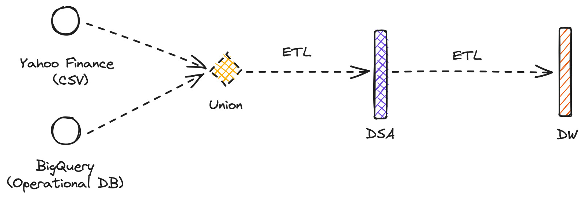
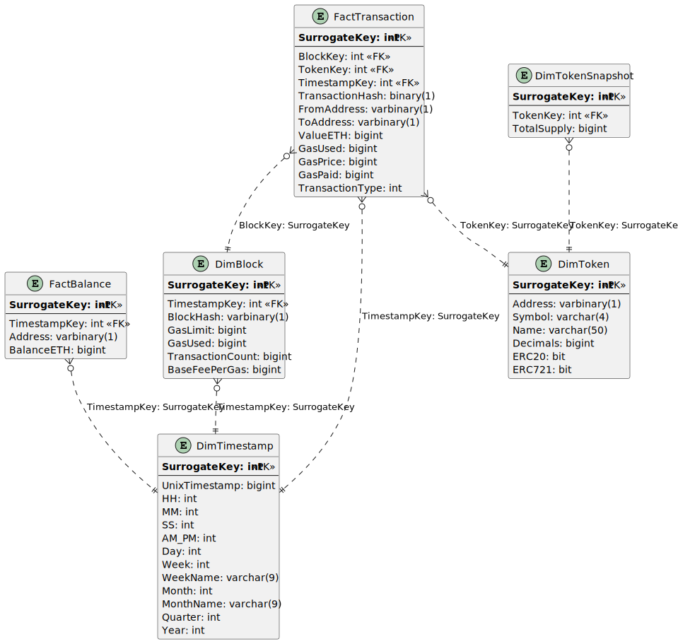

# Ethereum Chain Analysis And Data Warehouse Design
A project to design a fact and dimension star schema for optimizing queries on a Ethereum Chain database using MSSQL (Microsoft SQL Server), a relational database management system.

A data warehouse provides a consistent view of Ethereum data over time. The designed schema allows for efficient querying of data such as transaction dates, gas fees, and transaction volume information.

The ETL process for the Ethereum Chain Analysis is designed using Microsoft SQL Server Integration Services (SSIS).

# 0. Abstract
The Ethereum blockchain generates a significant amount of data due to its intrinsic transparency and decentralized nature.  It is also referred to as on-chain data and is openly accessible to the world.

A peer-to-peer network of mutually distrusting nodes maintains a common view of the global state and executes code upon request. The stated is stored in a blockchain secured by a proof-of-state consensus mechanism that work by selecting validators in proportion to their quantity of holdings.

Moreover, the on-chain data is timestamped, integrated, and validated into an open ledger. This important blockchain feature enables us to assess the network’s health and usage. It serves as a massive data warehouse for complex prediction algorithms, network adoption and much more.

# 1. Introduction

On-chain metrics such as active addresses, total addresses and transaction volume indicate the usage and adoption of the network.

- [ ] What is the total transaction volume on the eth chain over a specific time period?
- [ ] What are the most popularly exchanged digital tokens, represented by ERC-721 and ERC-20 smart contracts?
- [ ] The biggest transactions over the last 24 hours?
- [ ] Transactions with the highest gas fee over the last 24 hours?

## 1.1. Wei | The smallest denomination of ether
While the US dollar can only be divided into 100 equal parts i.e. into pennies, cryptocurrencies can be divided into much smaller atomic units. 

Wei is the smallest denomination of ether, the currency used to facilitate transactional operations on the Ethereum blockchain network, where `10^18` or `1,000,000,000,000,000,000 wei` is equivalent to one ether. 

Therefore, ether has multiple different levels of wei. Each subunit indicates the quantity of units but as mentioned above, have alternative names.

The table below illustrates the various units of wei.

| Unit        | Alternative Name | Wei Value             | Gwei Value            | Ether Value          |
|-------------|------------------|-----------------------|-----------------------|----------------------|
| Wei         | -                | 1                     | 10^-9 Gwei            | 10^-18 ETH           |
| Kwei        | Babbage          | 1,000                 | 10^-3 Wei            | 10^-6 Gwei           | 10^-15 ETH          |
| Mwei        | Lovelace         | 1,000,000             | 10^-6 Wei            | 10^-3 Gwei           | 10^-12 ETH          |
| Gwei        | Shannon          | 1,000,000,000         | 10^-9 Wei            | 1 Gwei               | 10^-9 ETH           |
| Microether  | Szabo            | 1,000,000,000,000     | 10^-12 Wei           | 10^-3 Gwei           | 10^-6 ETH           |
| Milliether  | Finney           | 1,000,000,000,000,000 | 10^-15 Wei           | 10^-6 Gwei           | 10^-3 ETH           |
| Ether       | -                | 1,000,000,000,000,000,000 | 10^-18 Wei      | 10^-9 Gwei       | 1 ETH              |

## 1.2. Compute the fee to execute a contract
As gas is the pricing value deemed necessary to execute a contract or other form of transaction on the Ethereum network, gwei is needed to pay for the computational power.

The standard transaction fee is 21,000 gwei on the Ethereum blockchain network. Typically, transaction fees will rise proportionately to the underlying complexity of the transaction.
The methodology to calculate the transaction fee is by using the following formula: 

`(receipt_gas_used * gas_price) / 10^-18`

# 2. Data Staging Area

## 2.1. DSA Overview


## 2.2. BigQuery
### 2.2.1 Retrieve Recent Data on Ethereum Blockchain
```
SELECT 
tx.token_address AS TokenAddress, 
tx.from_address AS FromAddress, 
tx.to_address AS ToAddress, 
tx.value AS TokenTransferValueETH, 
tx.block_timestamp AS TokenTransferTimestamp, 
trans.gas AS TransactionGas, 
trans.gas_price AS TransactionGasPrice, 
trans.receipt_gas_used AS TransactionGasUsed, 
blox.gas_limit AS BlockGasLimit, 
blox.base_fee_per_gas AS BlockBaseFeePerGas,
t.symbol,t.name AS TokenName, 
t.decimals AS TokenDecimals,
t.total_supply AS TokenTotalSupply,
contx.is_erc20 AS ContractIsERC20,
contx.is_erc721 AS ContractIsERC721
FROM 
  `bigquery-public-data.crypto_ethereum.token_transfers` tx 
  JOIN `bigquery-public-data.crypto_ethereum.tokens` t ON tx.token_address = t.address
  JOIN `bigquery-public-data.crypto_ethereum.transactions` trans ON trans.`hash` = tx.transaction_hash
  JOIN `bigquery-public-data.crypto_ethereum.blocks` blox ON blox.number = tx.block_number
  JOIN `bigquery-public-data.crypto_ethereum.contracts` contx ON contx.address = tx.token_address
WHERE date(blox.timestamp) BETWEEN date_sub(current_date, INTERVAL 1 MONTH) AND current_date()
ORDER BY date(tx.block_timestamp) DESC
```

## 2.3. DSA Implementation


# 3. Data Warehouse


## 3.1 Facts and Dimensions
The star schema for the Ethereum Chain Analysis and Data Warehouse Design consists of the following dimensions and facts:

| **Facts**           | **Description**                                                                                                                                |
|--------------------------|--------------------------------------------------------------------------------------------------------|
| **Transaction** | To store information about individual Ethereum transactions, such as transaction hash, block hash, transaction value, and transaction gas. |
| **Balance** | To store information about an address' balance at a given time. |

| **Dimensions**           | **Description**                                                                                        |
|--------------------------|--------------------------------------------------------------------------------------------------------|
| **Token**       | To store information about ERC-20 tokens, such as token contract address, token symbol, token name, and token total supply. |
| **Timestamp** | To store timestamps for various Ethereum-related events. |
| **Token Snapshot** |  Slowly Changing Dimension to store circulating supply. |
| **Block** | An Ethereum block that stores Ethereum transactions and defines the gas fee for the next block. |

## 3.2 Fact Specs
### 3.2.1. Transaction Fact Schema
| **Column** | **Type**| **Designation** |
|----------|-------------| -------- |
| **SurrogateKey** | int | Dimension | 
| **BlockKey** | int | Dimension |
| **TokenKey** | int | Dimension | 
| **TimeStampKey** | bigint | Dimension | 
| **TransactionHash** | binary(1) | Degenerated Dimension|
| **FromAddress** | varbinary(1) | Degenerated Dimension |
| **ToAddress** | varbinary(1) | Degenerated Dimension | 
| **ValueETH** | bigint | Metric |
| **GasUsed** | bigint | Metric |
| **GasPrice** | bigint| Metric |
| **GasPaid** | bigint | Metric |
| **TransactionType** | int | | 
### 3.2.2. Balance Fact Schema
| **Column**       | **Type**    | **Designation** |
| --------------   | ----------- | --------- | 
| **SurrogateKey** | int | Dimension | 
| **TimestampKey** | int | Dimension | 
| **Address** | varbinary(1) | Degenerated Dimension | 
| **BalanceETH**   | bigint | Metric |
## 3.3. Dimension Specs
### 3.3.1. Token Dim Schema
| **Column**       | **Type**    | **Designation** |
| --------------   | ----------- | -------- |
| **SurrogateKey**      | int | - |
| **Address**      | varbinary(1) |  |
| **Symbol**       | varchar(4)  | |
| **Name** | varchar(50) | |
| **Decimals** | bigint | |
| **ERC20** | bit | |
| **ERC721** | bit | |
### 3.3.2. Timestamp Dim Schema
| **Column**       | **Type**    | **Designation** |
| --------------   | ----------- | ---------------- |
| **SurrogateKey** | int | - |
| **UnixTimestamp** | bigint | |
| **HH** | int | | 
| **MM** | int | |   
| **SS** | int | |
| **AM_PM** | int | |
| **Day** | int | |
| **Week** | int | | 
| **WeekName** | varchar(9) | |
| **Month** | int | |
| **MonthName** | varchar(9) | |
| **Quarter** | int | |
| **Year** | int | |
### 3.3.3. Block Dim Schema
| **Column**       | **Type**    | **Designation** |
| --------------   | ----------- | ---------------- |
| **SurrogateKey** | int | - |
| **TimestampKey** | int | Dimension |
| **BlockHash** | varbinary(1) | Degenerated Dimension |
| **GasLimit** | bigint | Metric |
| **GasUsed** | bigint | Metric |
| **TransactionCount** | bigint | Metric |
| **BaseFeePerGas** | bigint | Metric |
### 3.4. Slowly Changing Dimensions
#### 3.4.1. Token Snapshot
| **Column**       | **Type**    | **Designation** |
| --------------   | ----------- | -------- |
| **SurrogateKey** | int | - |
| **TokenKey** | int | Dimension |
| **TotalSupply** | bigint | Metric |

## 3.5. SQL Syntax
```sql
create database DataWarehouse
go

use DataWarehouse
go

CREATE TABLE DimTimestamp
(
    SurrogateKey  INT        NOT NULL
        CONSTRAINT DimTimestamp_SurrogateKey PRIMARY KEY,
    UnixTimestamp BIGINT     NOT NULL,
    HH            INT        NOT NULL CHECK (HH >= 0 AND HH <= 23),
    MM            INT        NOT NULL CHECK (MM >= 0 AND MM <= 59),
    SS            INT        NOT NULL CHECK (SS >= 0 AND SS <= 59),
    AM_PM         INT        NOT NULL CHECK (AM_PM IN (0, 1)),
    Day           INT        NOT NULL CHECK (Day >= 1 AND Day <= 31),
    Week          INT        NOT NULL CHECK (Week >= 1 AND Week <= 53),
    WeekName      VARCHAR(9) NOT NULL,
    Month         INT        NOT NULL CHECK (Month >= 1 AND Month <= 12),
    MonthName     VARCHAR(9) NOT NULL,
    Quarter       INT        NOT NULL CHECK (Quarter >= 1 AND Quarter <= 4),
    Year          INT        NOT NULL
)
go

create table DimBlock
(
    SurrogateKey     int       not null
        constraint DimBlock_SurrogateKey
            primary key,
    BlockHash        varbinary not null,
    GasLimit         bigint    not null,
    GasUsed          bigint    not null,
    TimestampKey     int       not null
        constraint DimBlock_DimTimestamp_SurrogateKey_Foreign_Key
            references DimTimestamp,
    TransactionCount bigint    not null,
    BaseFeePerGas    bigint    not null
)
go

create table DimToken
(
    Address      varbinary   not null
        constraint DimToken_Address
            unique,
    Symbol       varchar(4)  not null,
    Name         varchar(50) not null,
    Decimals     bigint      not null,
    ERC20        bit         not null,
    ERC721       bit         not null,
    SurrogateKey int         not null
        constraint DimToken_SurrogateKey_Foreign_Key
            primary key
)
go

create table DimTokenSnapshot
(
    SurrogateKey int    not null
        constraint TokenSnapshot_SurrogateKey
            primary key,
    TokenKey     int    not null
        constraint DimTokenSnapshot_DimToken_SurrogateKey_Foreign_Key
            references DimToken,
    TotalSupply  bigint not null
)
go

create table FactBalance
(
    SurrogateKey int       not null
        constraint FactBalance_SurrogateKey
            primary key,
    Address      varbinary not null,
    BalanceETH   bigint    not null,
    TimestampKey int       not null
        constraint FactBalance_DimTimestamp_SurrogateKey_Foreign_Key
            references DimTimestamp
)
go

create table FactTransaction
(
    TransactionHash binary    not null,
    BlockKey        int       not null
        constraint FactTransaction_DimBlock_SurrogateKey_Foreign_Key
            references DimBlock,
    FromAddress     varbinary not null,
    ToAddress       varbinary not null,
    TokenKey        int       not null
        constraint FactTransaction_DimToken_SurrogateKey_Foreign_Key
            references DimToken,
    ValueETH        bigint    not null,
    GasUsed         bigint    not null,
    GasPrice        bigint    not null,
    GasPaid         bigint    not null,
    TransactionType int       not null,
    SurrogateKey    int       not null
        constraint FactTransaction_SurrogateKey
            primary key
)
go
```

# 4. Schemas

# 5. Diagrams
## 5.1. Data Warehouse Diagram

# 6. Power BI

# 7. References
- [x] Design And Representation Of The Time Dimension In Enterprise Data Warehouses [spec](https://www.scitepress.org/papers/2004/26426/26426.pdf)
- [x] Ethereum: State of Knowledge and Research Perspectives [spec](https://link.springer.com/chapter/10.1007/978-3-319-75650-9_14)
- [x] An On-Chain Analysis-Based Approach to Predict Ethereum Prices [spec](https://researchsystem.canberra.edu.au/ws/portalfiles/portal/53556322/An_On_Chain_Analysis_Based_Approach_to_Predict_Ethereum_Prices.pdf)
- [x] Gwei Calculator and Wei Converter [spec](https://www.alchemy.com/gwei-calculator)
