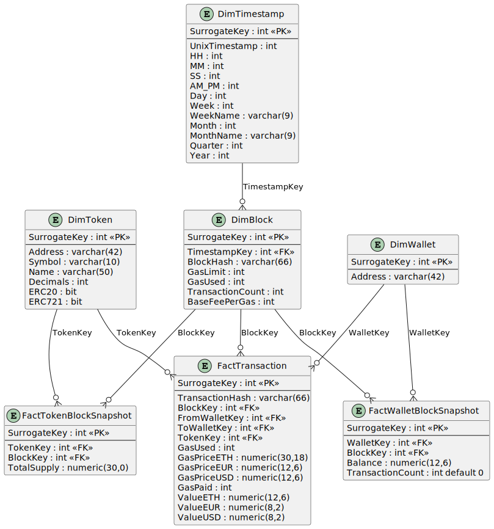

# Ethereum Chain Analysis And Data Warehouse Design

A project to design a fact and dimension star schema for optimizing queries on a Ethereum Chain database using MSSQL (Microsoft SQL Server), a relational database management system.

A data warehouse provides a consistent view of Ethereum data over time. The designed schema allows for efficient querying of data such as transaction dates, gas fees, and transaction volume information.

The ETL process for the Ethereum Chain Analysis is designed using Microsoft SQL Server Integration Services (SSIS).

Microsoft Power BI for an interactive data visualization.

## 0. Abstract
The Ethereum blockchain generates a significant amount of data due to its intrinsic transparency and decentralized nature. It is also referred to as on-chain data and is openly accessible to the world.

A peer-to-peer network of mutually distrusting nodes maintains a common view of the global state and executes code upon request. The stated is stored in a blockchain secured by a proof-of-state consensus mechanism that work by selecting validators in proportion to their quantity of holdings.

Moreover, the on-chain data is timestamped, integrated, and validated into an open ledger. This important blockchain feature enables us to assess the network’s health and usage. It serves as a massive data warehouse for complex prediction algorithms, network adoption and much more.

## 1. State of the Art
Most blockchains support an RPC API which allows users to interact with the chain and pull data in JSON format. These APIs include built-in methods which can be called on to get a variety of data attributes back from the blockchain (e.g. the `eth_blockNumber` method returns the current height of the Ethereum blockchain).

But knowing which methods to call and when can be challenging—for example, getting the transaction traces requires several RPC methods and a few data transformations. Lucky for us, Ethereum blockchain data is made accessible through BigQuery.

Nevertheless, when we zoom into the Google BigQuery Ethereum data sets, we notice that additional work is required to access important information.

## 2. Data Warehouse Concept
- [ ] Talk about Kimbal Bottom-Up
      
## 3. Transforming Blockchain Data
We will start loading small footprints of the Ethereum blockchain into our Data Storage Architecture (DSA).  Ideally the ETL process should pause when data collection catches up to the head of the chain. However, we incremental loading using the datetime stamp, looking only for the latest transactions missing in our database, this flow is triggered once a day at midnight or is manually triggered.

The following code snippet will stream from Ethereum over 500 GB of data from the last month and onwards into our DSA.
```sql
SELECT 
tx.token_address AS TokenAddress, 
tx.from_address AS FromAddress, 
tx.to_address AS ToAddress, 
tx.value AS TokenTransferValueETH, 
tx.block_timestamp AS TokenTransferTimestamp, 
trans.hash AS TransactionHash,
trans.gas AS TransactionGas, 
trans.gas_price AS TransactionGasPrice, 
trans.receipt_gas_used AS TransactionGasUsed, 
blox.hash AS BlockHash,
blox.gas_limit AS BlockGasLimit, 
blox.base_fee_per_gas AS BlockBaseFeePerGas,
blox.gas_used AS BlockGasUsed,
blox.transaction_count AS BlockTransactionCount,
t.symbol AS TokenSymbol,
t.name AS TokenName, 
t.decimals AS TokenDecimals,
t.total_supply AS TokenTotalSupply,
contx.is_erc20 AS ContractIsERC20,
contx.is_erc721 AS ContractIsERC721
FROM 
  `bigquery-public-data.crypto_ethereum.token_transfers` tx 
  JOIN `bigquery-public-data.crypto_ethereum.tokens` t ON tx.token_address = t.address
  JOIN `bigquery-public-data.crypto_ethereum.transactions` trans ON trans.`hash` = tx.transaction_hash
  JOIN `bigquery-public-data.crypto_ethereum.blocks` blox ON blox.number = tx.block_number
  JOIN `bigquery-public-data.crypto_ethereum.contracts` contx ON contx.address = tx.token_address
WHERE date(blox.timestamp) BETWEEN date_sub(current_date, INTERVAL 1 MONTH) AND current_date()
ORDER BY date(tx.block_timestamp) DESC
LIMIT 50
```

To enhance our analysis and provide a broader perspective, we propose the inclusion of daily quotes for Ethereum in both USD and EUR from Yahoo Finance. 

For the sake of the project we will manually download the most recent data, which we limited to the latest year, directly from Yahoo website. These flat CSV files will serve as supplementary data, allowing us to compute transaction values in both USD and EUR.

The CSV structue is as follows: (what's really matters here is Date and Adj Close)

| Date       | Open         | High         | Low          | Close        | Adj Close    | Volume      |
|------------|--------------|--------------|--------------|--------------|--------------|-------------|
| 2023-01-19 | 1403.281738  | 1437.872681  | 1402.476440  | 1433.107544  | 1433.107544  | 5937730920  |

Now that we have the raw data saved with both blockchain transaction details and external market quotes, the next step is to load this data into our Data Warehouse (DW).
## 4. Designing Our Data Warehouse
We have chosen to adopt the Dimensional Fact Model (DFM) as our method of choice. The approach involves creating a structured representation that highlights key dimensions and facts.

In our case study the finest level of detail, or granularity, is represented by an individual transaction as of analyzing at the transaction level allows us to capture the nuances of interactions within the blockchain.

Once the grain of the fact table has been established, the next step is to select the relevant dimensions. In this case, two primary dimensions stand out: "Block" and "Token":
- Block Dimension: This dimension captures details about the Ethereum blocks in which transactions occur. It includes information such as block number, timestamp, and other block-related metadata.
- Token Dimension: This dimension focuses on the various tokens involved in transactions. It includes details like token type, contract address, and additional token-related information.

Identifying the facts involves gathering various pieces of information from both transactions and token transfers within the Ethereum blockchain.
To simplify the representation we merge these pieces into a unified fact, serving as a consolidated view for ERC-20 and ERC-721 transactions.

- [ ] TODO: Explain we have a multi star schema

## 5. Loading Into Data Warehouse
In this step, we will show high-level steps on how we built our blockchain ETL pipeline. 

For demonstration purposes we will assume that dimensions tables for blocks, tokens and fact transactions,  have already been created in our data warehouse and the columns line up with what's in the ETL process.

- [ ] Explain ETL pipeline

## 6. Designing PowerBI Dashboard
We don't have a proper list of queries we want to make, typically the manager chooses a data exploration path that was not anticipated by the development team, so let's analyze the data we extract to the Data Warehouse and analyze the queries we can make!

- [x] Average Gas Evolution over time (per BlockKey and TimestampKey)
- [x] Wallet Balance over time (aggregate per WalletKey)

## A1.  Data Warehouse ER Diagram

## A2. Transactions DFM

## A3. WalletBlockSnapshot DFM

## A4. TokenBlockSnapshot DFM

## A5. ETL BPMN

## A6. DSA SSIS

## A7. DW SSIS (DimTimestamp)

## A8. DW SSIS (DimBlock)

## A9. DW SSIS (DimToken)

## A10. DW SSIS (DimWallet)

## A11. DW SSIS (FactTransaction)

## A12. DW SSIS (FactTokenBlockSnapshot)

## A13. DW SSIS (FactWalletBlockSnapshot)

## References
The DIY Blockchain Data Warehouse, By Steven Wang — Aug 23, 2022 https://blog.luabase.com/diy-blockchain-data-warehouse
